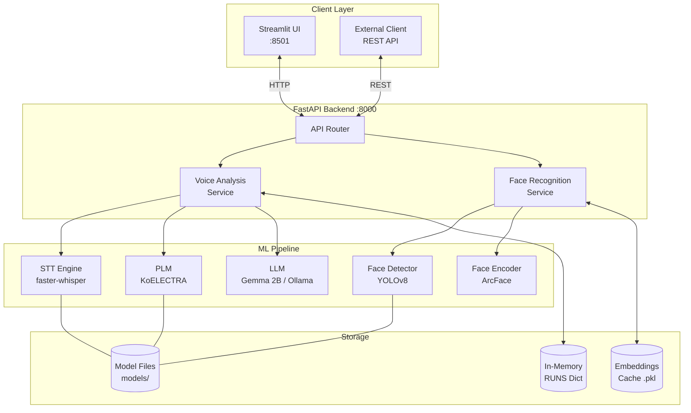
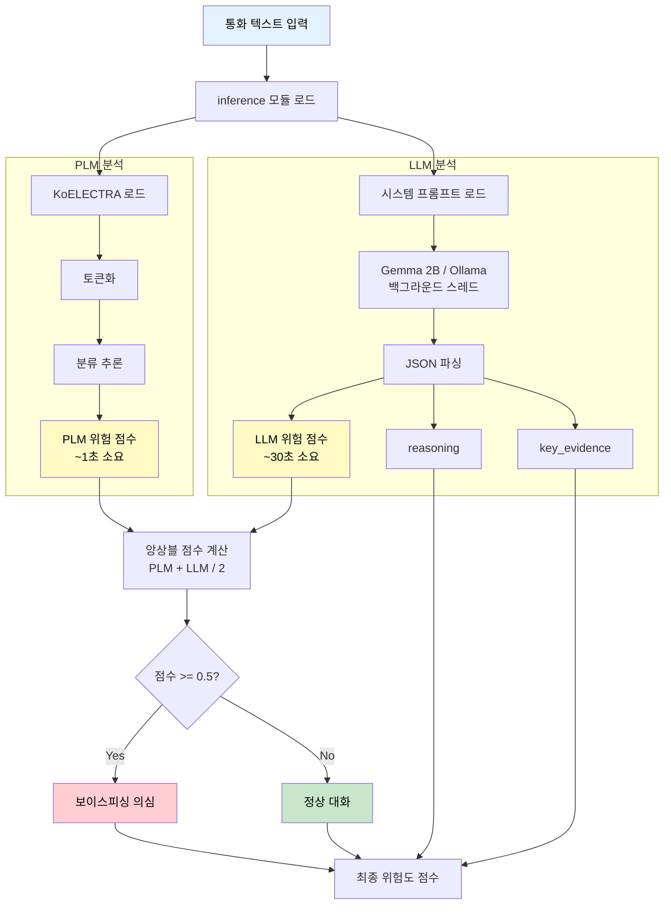

# Voice Phishing Protector


## 서비스 설명

[](https://youtu.be/MbeziXc_OCE)
- 보이스피싱 탐지를 파인튜닝된 트랜스포머 인코더 모델인 PLM과 디코더 모델인 LLM을 통해 진행하는 하이브리드 탐지 
- 보이스피싱으로 탐지되었을 경우 YOLO와 DeepFace를 이용한 안면인식으로 현금인출을 정지하는 서비스(안면인식 까지만)


## 주요 기능

- **실시간 보이스피싱 탐지**: PLM(KoELECTRA)과 LLM(Gemma 2B)의 앙상블 분석으로 높은 정확도 제공
- **STT 음성-텍스트 변환**: faster-whisper 기반 실시간 전사 (5초 단위 청크 처리)
- **얼굴 인식 시스템**: YOLOv8 탐지 + ArcFace 임베딩으로 발신자 신원 확인
- **비동기 분석 API**: Long-polling 지원 REST API로 실시간 분석 상태 조회
- **웹 UI 대시보드**: Streamlit 기반 직관적인 분석 도구

## 기술 스택

### Backend

| 기술 | 버전 | 용도 |
|-----|------|-----|
| Python | 3.11+ | 메인 언어 |
| FastAPI | 0.117.1+ | REST API 서버 |
| Streamlit | 1.39.0+ | 웹 UI 프레임워크 |
| faster-whisper | 1.0.2+ | STT 엔진 |
| transformers | 4.35.0+ | KoELECTRA PLM |
| PEFT | 0.7.0+ | QLoRA 파인튜닝 |
| Ultralytics | 8.0.0+ | YOLOv8 얼굴 탐지 |
| DeepFace | 0.0.79+ | ArcFace 얼굴 인식 |
| Ollama | 0.2.1+ | 로컬 LLM 추론 |
| OpenAI | 1.0.0+ | 클라우드 LLM (선택) |

### Infrastructure

| 기술 | 용도 |
|-----|-----|
| Pydantic | 설정 관리 및 데이터 검증 |
| uvicorn | ASGI 서버 |

## 시스템 아키텍처



## 핵심 기술 요약

| 기술 | 선택 이유 | 핵심 기능 |
|-----|----------|----------|
| **PLM (KoELECTRA)** | 한국어 보이스피싱 패턴 특화 분류 | CPU에서도 수초 내 추론, 512토큰 처리 |
| **LLM (Gemma 2B) QLoRA** | 맥락/논리 분석, 신종 수법 탐지 | 4-bit 양자화로 VRAM 75% 절감 |
| **PLM+LLM 앙상블** | 상호 보완적 분석 | PLM 즉시 응답 + LLM 심층 분석 |
| **YOLO + ArcFace** | 실시간 다중 얼굴 인식 | 99%+ LFW 정확도, pickle 캐시 최적화 |

## 빠른 시작

### 사전 요구사항

- Python 3.11 이상
- CUDA 지원 GPU (권장, CPU에서도 동작)
- [Ollama](https://ollama.ai/) (로컬 LLM 사용 시)

### 설치

```bash
# 저장소 클론
git clone https://github.com/your-org/voice-phishing-protector.git
cd voice-phishing-protector

# 가상환경 생성 및 활성화
python -m venv .venv
source .venv/bin/activate  # Windows: .venv\Scripts\activate

# 의존성 설치 (uv 사용 권장)
uv pip install -e .

# 또는 pip 사용
pip install -e .

# PyTorch CUDA 버전 별도 설치 (GPU 사용 시)
pip install torch --index-url https://download.pytorch.org/whl/cu121
```

### 환경 변수 설정

```bash
cp .env.example .env
```

주요 환경 변수:

| 변수명 | 설명 | 기본값 |
|-------|------|-------|
| `API_PORT` | FastAPI 서버 포트 | 8000 |
| `OLLAMA_URL` | Ollama 서버 URL | http://127.0.0.1:11434 |
| `OLLAMA_MODEL` | 사용할 LLM 모델 | gemma2:9b |
| `STT_MODEL` | Whisper 모델 크기 | small |
| `STT_DEVICE` | 실행 디바이스 | auto |
| `SIMILARITY_THRESHOLD` | 얼굴 유사도 임계값 | 0.70 |
| `PHISHING_THRESHOLD` | 피싱 판정 임계값 | 0.5 |

전체 환경 변수는 [.env.example](.env.example)을 참조하세요.

### 실행

```bash
# 1. Ollama 서버 실행 (로컬 LLM 사용 시)
ollama serve

# 2. FastAPI 백엔드 서버 실행
python main.py
# 또는
uvicorn main:app --host 0.0.0.0 --port 8000 --reload

# 3. Streamlit UI 실행 (새 터미널)
streamlit run app.py --server.address 0.0.0.0 --server.port 8501
```

서버 실행 후:
- FastAPI 문서: http://localhost:8000/docs
- Streamlit UI: http://localhost:8501

## API 엔드포인트

| 메서드 | 엔드포인트 | 설명 |
|-------|-----------|------|
| GET | `/` | 서버 상태 확인 |
| GET | `/health` | 헬스 체크 |
| POST | `/analyze` | 오디오 파일 분석 시작 |
| GET | `/status/{run_id}` | 분석 상태 조회 |
| POST | `/predict_text` | 텍스트 직접 분석 |
| POST | `/face_recognize` | 이미지에서 얼굴 인식 |
| POST | `/face_register` | 새 얼굴 등록 |
| DELETE | `/face_unregister/{name}` | 등록된 얼굴 삭제 |
| GET | `/face_list` | 등록된 얼굴 목록 조회 |

상세 API 문서는 [docs/API_FLOW.md](docs/API_FLOW.md)를 참조하세요.

## 프로젝트 구조

```
voice-phishing-protector/
├── main.py                     # FastAPI 앱 엔트리포인트
├── app.py                      # Streamlit UI 엔트리포인트
├── pyproject.toml              # 프로젝트 설정 및 의존성
├── .env.example                # 환경 변수 예시
│
├── src/                        # 메인 소스 코드
│   ├── api/                    # API 라우터
│   │   ├── voice_analysis.py   # 음성 분석 API
│   │   └── face_recognition.py # 얼굴 인식 API
│   ├── core/                   # 핵심 모듈
│   │   ├── config.py           # 설정 관리 (pydantic-settings)
│   │   ├── exceptions.py       # 커스텀 예외 계층
│   │   └── utils.py            # 유틸리티 함수
│   ├── models/                 # 데이터 모델
│   │   └── schemas.py          # Pydantic 스키마
│   └── services/               # 서비스 레이어
│       ├── stt_service.py      # STT 서비스
│       ├── face_service.py     # 얼굴 인식 서비스
│       └── llm_service.py      # LLM 서비스
│
├── models/                     # ML 모델 파일
│   ├── yolov8l_100e.pt         # YOLO 얼굴 탐지 모델
│   ├── koelectra_finetuned/    # KoELECTRA PLM
│   └── gemma_2b_finetuned/     # Gemma 2B LLM (QLoRA)
│
├── scripts/                    # 스크립트
│   └── finetuning/             # 파인튜닝 관련
│       ├── inference.py        # 추론 모듈
│       ├── finetuning_koelectra_base.ipynb
│       └── finetuning_gemma.ipynb
│
├── pages/                      # Streamlit 페이지
│   ├── 1_voice_phishing_scan.py
│   └── 2_face_recognition.py
│
├── data/                       # 데이터
│   ├── face_images/            # 등록된 얼굴 이미지
│   └── training_data/          # 학습 데이터
│
├── cache/                      # 런타임 캐시
│   └── known_face_embeddings.pkl
│
├── tests/                      # 테스트
│   └── test_services.py
│
└── docs/                       # 문서
    ├── API_FLOW.md             # API 및 데이터 플로우 문서
    └── 핵심기술.md              # 핵심 기술 상세 설명
```

## 분석 파이프라인



## 개발 가이드

### 테스트 실행

```bash
# 전체 테스트
pytest

# 커버리지 포함
pytest --cov=src --cov-report=html
```

### 코드 스타일

```bash
# 린팅 및 포매팅 (ruff)
ruff check .
ruff format .

# 타입 체크
mypy src/
```

## 관련 문서

- [API 및 데이터 플로우 문서](docs/API_FLOW.md) - 상세 API 스펙 및 플로우 다이어그램
- [핵심 기술 정리](docs/핵심기술.md) - PLM/LLM 파인튜닝, 앙상블 탐지, 얼굴 인식 상세 설명

## 라이선스

이 프로젝트는 MIT 라이선스를 따릅니다.
