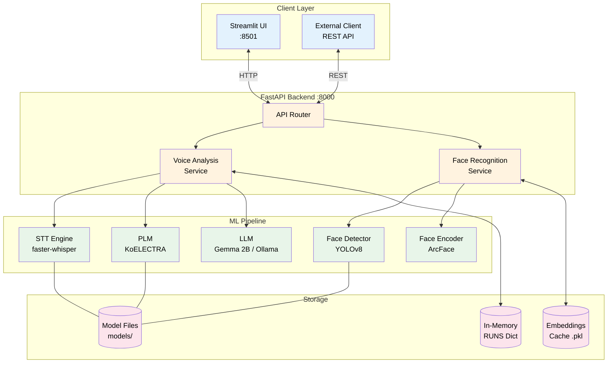
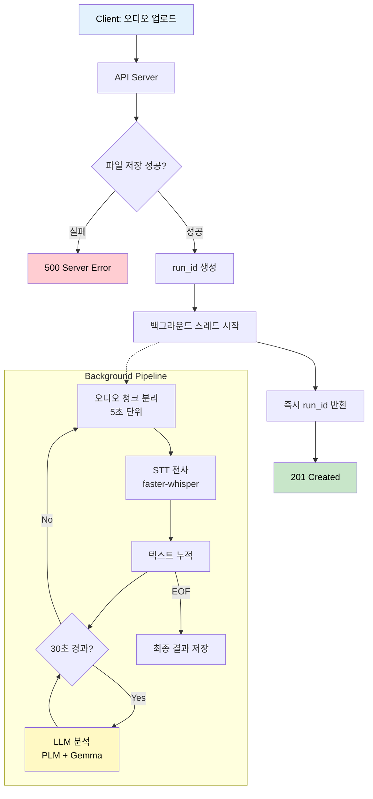
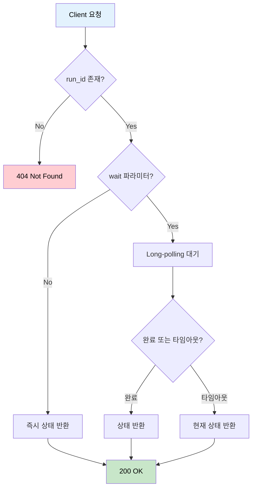
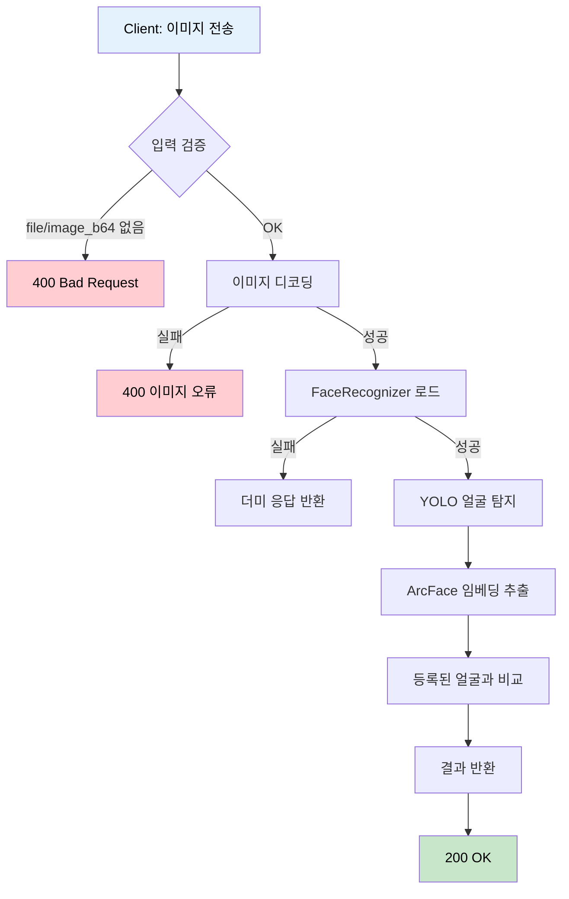
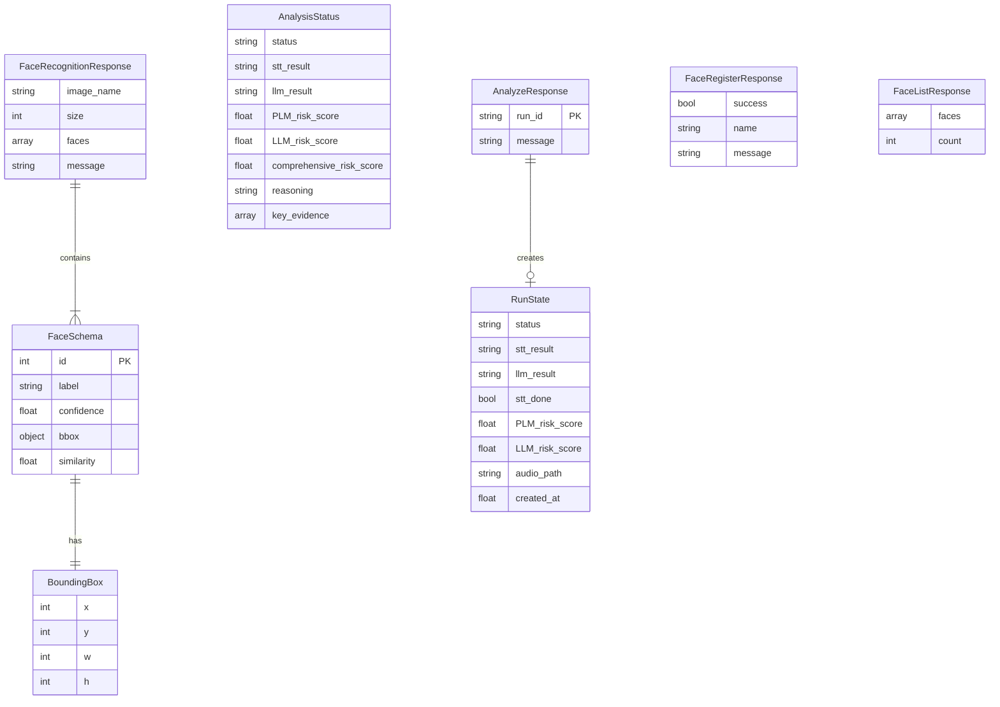
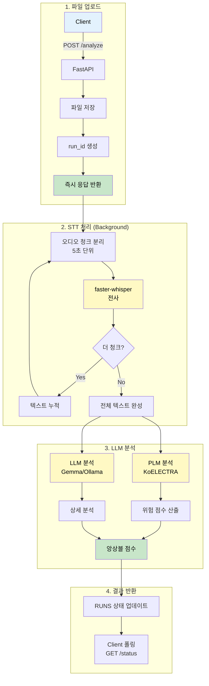
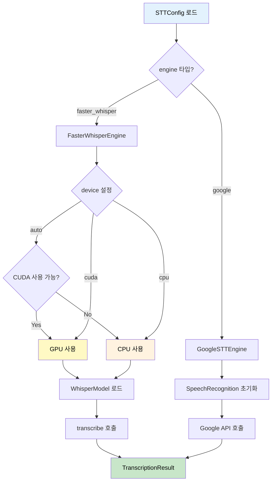
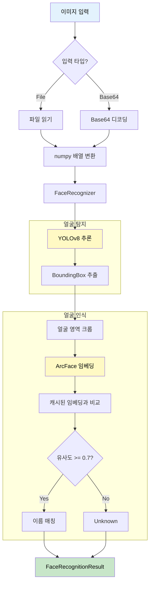
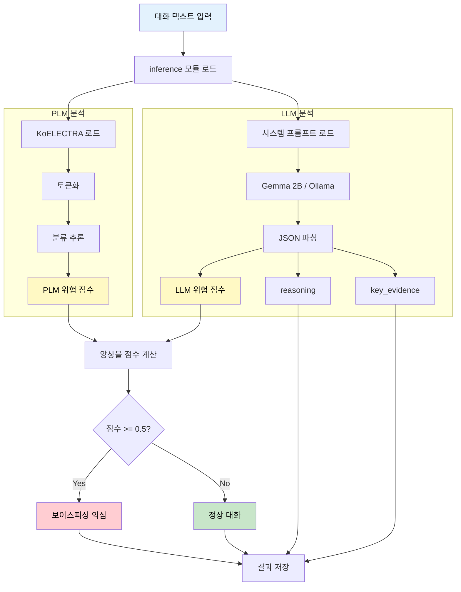
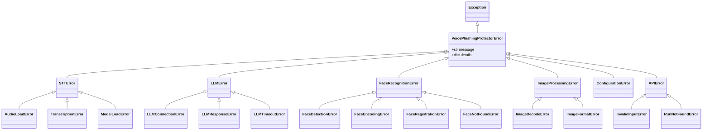

# Voice Phishing Protector API & Data Flow 문서

> 최종 업데이트: 2026-02-02
> Base URL: `http://localhost:8000`

---

## 목차

1. [개요](#1-개요)
2. [API 엔드포인트](#2-api-엔드포인트)
3. [데이터](#3-데이터)
4. [플로우 다이어그램](#4-플로우-다이어그램)
5. [에러 처리](#5-에러-처리)
6. [부록](#6-부록)

---

<!-- SECTION:OVERVIEW:START -->
## 1. 개요

### 1.1 시스템 아키텍처



### 1.2 기술 스택

| 구분 | 기술 | 버전 |
|-----|------|-----|
| Language | Python | 3.11 ~ 3.12 |
| Web Framework | FastAPI | 0.117.1+ |
| UI Framework | Streamlit | 1.39.0+ |
| STT Engine | faster-whisper | 1.0.2+ |
| Face Detection | YOLOv8 (ultralytics) | 8.0.0+ |
| Face Recognition | DeepFace (ArcFace) | 0.0.79+ |
| NLP (PLM) | transformers (KoELECTRA) | 4.35.0+ |
| NLP (LLM) | Ollama / OpenAI | - |
| Validation | Pydantic | 2.0.0+ |

### 1.3 외부 서비스

| 서비스 | 용도 | 비고 |
|-------|------|-----|
| Ollama | 로컬 LLM 추론 | gemma2:9b 기본 |
| OpenAI API | 클라우드 LLM (선택) | gpt-4o-mini |
| Google STT | 대체 STT 엔진 (선택) | 네트워크 필요 |

### 1.4 포트 정보

| 서비스 | 포트 | 설명 |
|-------|------|------|
| FastAPI Server | 8000 | 메인 REST API |
| Streamlit UI | 8501 | 웹 UI |
| Ollama | 11434 | 로컬 LLM 서버 |
<!-- SECTION:OVERVIEW:END -->

---

<!-- SECTION:API:START -->
## 2. API 엔드포인트

> **범례**: 🟢 GET | 🟡 POST | 🔴 DELETE

### 2.1 요약 테이블

<!-- API:SUMMARY:START -->
| 메서드 | 엔드포인트 | 설명 | 태그 |
|-------|-----------|------|------|
| 🟢 GET | `/` | 서버 상태 확인 | Root |
| 🟢 GET | `/health` | 헬스 체크 | Root |
| 🟡 POST | `/analyze` | 오디오 파일 분석 시작 | Voice Analysis |
| 🟢 GET | `/status/{run_id}` | 분석 상태 조회 | Voice Analysis |
| 🟡 POST | `/predict_text` | 텍스트 직접 분석 | Voice Analysis |
| 🟡 POST | `/face_recognize` | 이미지에서 얼굴 인식 | Face Recognition |
| 🟡 POST | `/face_register` | 새 얼굴 등록 | Face Recognition |
| 🔴 DELETE | `/face_unregister/{name}` | 등록된 얼굴 삭제 | Face Recognition |
| 🟢 GET | `/face_list` | 등록된 얼굴 목록 조회 | Face Recognition |
<!-- API:SUMMARY:END -->

### 2.2 상세 API

<!-- API:DETAIL:START -->

---

#### 🟢 GET `/`

> 서버 상태 확인 엔드포인트

**Response (200 OK):**

```json
{
    "status": "healthy",
    "service": "Voice Phishing Protector",
    "version": "1.0.0",
    "message": "API가 정상적으로 실행 중입니다."
}
```

---

#### 🟢 GET `/health`

> 헬스 체크 엔드포인트 (컨테이너/로드밸런서용)

**Response (200 OK):**

```json
{
    "status": "ok"
}
```

---

#### 🟡 POST `/analyze`

> 오디오 파일 분석을 시작합니다 (비동기 처리)

**Flow:**



**Request:**

| Content-Type | `multipart/form-data` |
|--------------|----------------------|

| 필드 | 타입 | 필수 | 설명 | 제약조건 |
|-----|------|-----|------|---------|
| file | File | O | 오디오 파일 | MP3, WAV, FLAC, OGG |
| sys_prompt | string | X | LLM 시스템 프롬프트 | - |

**Response (200 OK):**

```json
{
    "run_id": "a1b2c3d4e5f6...",
    "message": "분석이 시작되었습니다."
}
```

| 필드 | 타입 | 설명 |
|-----|------|------|
| run_id | string | 분석 작업 식별자 (UUID hex) |
| message | string | 상태 메시지 |

**내부 처리:**

1. 오래된 분석 작업 정리 (max 100개)
2. 임시 파일 정리
3. 파일 저장 (`pages/{run_id}.{ext}`)
4. RUNS 상태 초기화
5. 백그라운드 스레드에서 `analysis_pipeline()` 실행
6. 즉시 run_id 반환

---

#### 🟢 GET `/status/{run_id}`

> 분석 상태를 조회합니다 (long-polling 지원)

**Flow:**



**Path Parameters:**

| 파라미터 | 타입 | 필수 | 설명 |
|---------|------|-----|------|
| run_id | string | O | 분석 작업 식별자 |

**Query Parameters:**

| 파라미터 | 타입 | 필수 | 기본값 | 설명 |
|---------|------|-----|-------|------|
| wait | int | X | - | Long-polling 활성화 (값이 있으면 대기) |
| timeout | int | X | 25 | Long-polling 최대 대기 시간 (초) |

**Response (200 OK):**

```json
{
    "status": "all_complete",
    "stt_result": "안녕하세요. 저는 검찰청 직원입니다...",
    "llm_result": "종합 점수: 0.785\nPLM 점수: 0.850\nLLM 점수: 0.720\n설명: 검찰 사칭 의심",
    "PLM_risk_score": 0.85,
    "LLM_risk_score": 0.72,
    "comprehensive_risk_score": 0.785,
    "reasoning": "검찰 사칭 의심 패턴 발견",
    "key_evidence": ["검찰청 사칭", "계좌 이체 요구"]
}
```

| 필드 | 타입 | 설명 |
|-----|------|------|
| status | string | 현재 상태 (pending, processing_stt, processing_llm, all_complete, error) |
| stt_result | string | STT 결과 텍스트 |
| llm_result | string | LLM 분석 결과 (포맷팅됨) |
| PLM_risk_score | float? | PLM 위험 점수 (0.0 ~ 1.0) |
| LLM_risk_score | float? | LLM 위험 점수 (0.0 ~ 1.0) |
| comprehensive_risk_score | float? | 종합 위험 점수 |
| reasoning | string? | LLM 판단 근거 |
| key_evidence | string[]? | 핵심 증거 목록 |

**상태 전이:**

```
pending → processing_stt → processing_llm → all_complete
                                         ↘ error
```

---

#### 🟡 POST `/predict_text`

> 텍스트를 직접 분석합니다 (STT 건너뛰기)

**Request:**

| Content-Type | `application/x-www-form-urlencoded` |
|--------------|-------------------------------------|

| 필드 | 타입 | 필수 | 설명 |
|-----|------|-----|------|
| run_id | string | O | 분석 작업 식별자 |
| text | string | O | 분석할 텍스트 (대화 내용) |

**Response (200 OK):**

```json
{
    "run_id": "a1b2c3d4e5f6...",
    "message": "분석이 시작되었습니다."
}
```

**에러 응답:**

| 코드 | 상황 |
|-----|------|
| 503 | inference 모듈 사용 불가 |
| 500 | PLM 모델 로드 실패 또는 분석 시작 실패 |

---

#### 🟡 POST `/face_recognize`

> 이미지에서 얼굴을 인식합니다

**Flow:**



**Request:**

| Content-Type | `multipart/form-data` |
|--------------|----------------------|

| 필드 | 타입 | 필수 | 설명 |
|-----|------|-----|------|
| file | File | △ | 이미지 파일 (file 또는 image_b64 중 하나 필수) |
| image_b64 | string | △ | Base64 인코딩된 이미지 |

**Response (200 OK):**

```json
{
    "image_name": "uploaded_image.jpg",
    "size": 245760,
    "faces": [
        {
            "id": 1,
            "label": "홍길동",
            "confidence": 0.95,
            "bbox": {
                "x": 100,
                "y": 50,
                "w": 150,
                "h": 180
            },
            "similarity": 0.87
        }
    ],
    "message": "1개의 얼굴이 탐지되었습니다. 인식된 사람: 홍길동"
}
```

| 필드 | 타입 | 설명 |
|-----|------|------|
| image_name | string? | 이미지 파일명 |
| size | int? | 이미지 크기 (바이트) |
| faces | FaceSchema[] | 탐지된 얼굴 목록 |
| message | string | 상태 메시지 |

**FaceSchema:**

| 필드 | 타입 | 설명 |
|-----|------|------|
| id | int | 얼굴 ID |
| label | string? | 인식된 이름 (Unknown이면 미등록) |
| confidence | float | YOLO 탐지 신뢰도 |
| bbox | BoundingBox | 바운딩 박스 (x, y, w, h) |
| similarity | float? | 등록된 얼굴과의 유사도 |

---

#### 🟡 POST `/face_register`

> 새 얼굴을 등록합니다

**Request:**

| Content-Type | `multipart/form-data` |
|--------------|----------------------|

| 필드 | 타입 | 필수 | 설명 |
|-----|------|-----|------|
| name | string | O | 등록할 이름 (1자 이상) |
| file | File | △ | 얼굴 이미지 파일 |
| image_b64 | string | △ | Base64 인코딩된 얼굴 이미지 |

**Response (200 OK):**

```json
{
    "success": true,
    "name": "홍길동",
    "message": "'홍길동' 얼굴이 성공적으로 등록되었습니다."
}
```

**에러 응답:**

| 코드 | 상황 |
|-----|------|
| 400 | 입력 누락 또는 등록 실패 |
| 503 | 얼굴 인식 서비스 미초기화 |
| 500 | 처리 오류 |

---

#### 🔴 DELETE `/face_unregister/{name}`

> 등록된 얼굴을 삭제합니다

**Path Parameters:**

| 파라미터 | 타입 | 필수 | 설명 |
|---------|------|-----|------|
| name | string | O | 삭제할 이름 |

**Response (200 OK):**

```json
{
    "success": true,
    "name": "홍길동",
    "message": "'홍길동' 얼굴이 성공적으로 삭제되었습니다."
}
```

---

#### 🟢 GET `/face_list`

> 등록된 얼굴 목록을 조회합니다

**Response (200 OK):**

```json
{
    "faces": ["홍길동", "김철수", "이영희"],
    "count": 3
}
```

| 필드 | 타입 | 설명 |
|-----|------|------|
| faces | string[] | 등록된 이름 목록 |
| count | int | 등록된 얼굴 수 |

<!-- API:DETAIL:END -->

<!-- SECTION:API:END -->

---

<!-- SECTION:DATA:START -->
## 3. 데이터

### 3.1 스키마 계층 구조

<!-- DATA:ER:START -->

<!-- DATA:ER:END -->

### 3.2 Request/Response 스키마 상세

<!-- DATA:TABLES:START -->

#### AnalyzeResponse

> 분석 시작 응답

| 필드 | 타입 | 필수 | 기본값 | 설명 |
|-----|------|-----|-------|------|
| run_id | string | O | - | 분석 작업 식별자 (UUID hex) |
| message | string | X | "분석이 시작되었습니다." | 상태 메시지 |

---

#### AnalysisStatus

> 분석 상태 응답 (GET /status/{run_id})

| 필드 | 타입 | 필수 | 범위 | 설명 |
|-----|------|-----|------|------|
| status | string | O | - | 현재 상태 (pending, processing_stt, processing_llm, all_complete, error) |
| stt_result | string | X | - | STT 결과 텍스트 |
| llm_result | string | X | - | LLM 분석 결과 (포맷팅됨) |
| PLM_risk_score | float | X | 0.0 ~ 1.0 | PLM 위험 점수 |
| LLM_risk_score | float | X | 0.0 ~ 1.0 | LLM 위험 점수 |
| LLM_reported_score | float | X | 0.0 ~ 1.0 | LLM이 직접 보고한 점수 |
| comprehensive_risk_score | float | X | 0.0 ~ 1.0 | 종합 위험 점수 |
| reasoning | string | X | - | LLM 판단 근거 |
| key_evidence | string[] | X | - | 핵심 증거 목록 |
| llm_text | string | X | - | LLM 원본 응답 |

---

#### FaceRecognitionResponse

> 얼굴 인식 응답

| 필드 | 타입 | 필수 | 설명 |
|-----|------|-----|------|
| image_name | string | X | 이미지 파일명 |
| size | int | X | 이미지 크기 (바이트) |
| faces | FaceSchema[] | X | 탐지된 얼굴 목록 |
| message | string | X | 상태 메시지 |

---

#### FaceSchema

> 단일 얼굴 정보

| 필드 | 타입 | 필수 | 범위 | 설명 |
|-----|------|-----|------|------|
| id | int | O | - | 얼굴 ID |
| label | string | X | - | 인식된 이름 (미등록: null) |
| confidence | float | O | 0.0 ~ 1.0 | YOLO 탐지 신뢰도 |
| bbox | BoundingBox | O | - | 바운딩 박스 |
| similarity | float | X | 0.0 ~ 1.0 | 등록된 얼굴과의 유사도 |

---

#### BoundingBoxSchema

> 바운딩 박스

| 필드 | 타입 | 필수 | 설명 |
|-----|------|-----|------|
| x | int | O | 좌상단 X 좌표 |
| y | int | O | 좌상단 Y 좌표 |
| w | int | O | 너비 |
| h | int | O | 높이 |

---

#### FaceRegisterResponse

> 얼굴 등록/삭제 응답

| 필드 | 타입 | 필수 | 설명 |
|-----|------|-----|------|
| success | bool | O | 작업 성공 여부 |
| name | string | O | 대상 이름 |
| message | string | X | 상태 메시지 |

---

#### FaceListResponse

> 등록된 얼굴 목록 응답

| 필드 | 타입 | 필수 | 기본값 | 설명 |
|-----|------|-----|-------|------|
| faces | string[] | X | [] | 등록된 이름 목록 |
| count | int | X | 0 | 등록된 얼굴 수 |

---

#### RunState (내부용)

> RUNS 딕셔너리에 저장되는 분석 작업 상태

| 필드 | 타입 | 기본값 | 설명 |
|-----|------|-------|------|
| status | string | "pending" | 현재 상태 |
| stt_result | string | "" | 누적 STT 결과 |
| llm_result | string | "" | LLM 분석 결과 |
| stt_done | bool | false | STT 완료 여부 |
| audio_path | string | null | 오디오 파일 경로 |
| created_at | float | null | 생성 타임스탬프 |

<!-- DATA:TABLES:END -->

### 3.3 내부 상태 저장소

#### RUNS (In-Memory Dict)

```python
# src/api/voice_analysis.py
RUNS: Dict[str, Dict[str, Any]] = {}

# 구조:
# {
#     "run_id_hex": {
#         "status": "processing_stt",
#         "stt_result": "누적된 텍스트...",
#         "llm_result": "",
#         "stt_done": False,
#         "audio_path": "pages/abc123.wav",
#         "created_at": 1706841600.0
#     }
# }
```

**주의사항:**
- 서버 재시작 시 상태 유실
- 멀티 프로세스 환경에서 공유 불가
- 프로덕션에서는 Redis/Memcached로 교체 권장

#### EmbeddingCache (Pickle)

```python
# cache/known_face_embeddings.pkl
# 구조:
# {
#     "names": ["홍길동", "김철수"],
#     "encodings": [np.array([...]), np.array([...])]
# }
```

<!-- SECTION:DATA:END -->

---

<!-- SECTION:FLOW:START -->
## 4. 플로우 다이어그램

<!-- FLOW:LIST:START -->

### 4.1 음성 분석 전체 파이프라인

> 오디오 파일 업로드부터 보이스피싱 판정까지의 전체 흐름



**핵심 포인트:**
- 비동기 처리: 즉시 응답 후 백그라운드에서 분석
- 청크 단위 STT: 실시간 피드백 가능
- 앙상블 점수: PLM + LLM 가중 평균

---

### 4.2 STT 엔진 선택 흐름

> STT 엔진 초기화 및 전사 처리



**엔진 비교:**

| 엔진 | 속도 | 정확도 | 네트워크 | 권장 상황 |
|-----|-----|-------|---------|---------|
| FasterWhisper | 빠름 (GPU) | 높음 | 불필요 | 로컬 환경 |
| GoogleSTT | 보통 | 보통 | 필요 | 경량 환경 |

---

### 4.3 얼굴 인식 파이프라인

> 이미지 입력부터 인식 결과까지



**핵심 포인트:**
- 2단계 파이프라인: 탐지 (YOLO) → 인식 (ArcFace)
- 캐시 활용: 등록된 임베딩은 pickle로 저장
- 유사도 임계값: 0.7 (설정 가능)

---

### 4.4 LLM 분석 흐름

> PLM과 LLM을 결합한 앙상블 분석



**앙상블 공식:**

```
comprehensive_score = PLM_weight × PLM_score + LLM_weight × LLM_score
                    = 0.5 × PLM_score + 0.5 × LLM_score
```

<!-- FLOW:LIST:END -->

<!-- SECTION:FLOW:END -->

---

<!-- SECTION:ERROR:START -->
## 5. 에러 처리

### 5.1 HTTP 상태 코드

| 코드 | 상태 | 설명 | 조치 |
|-----|------|------|-----|
| 200 | OK | 성공 | - |
| 400 | Bad Request | 잘못된 요청 (입력 누락, 형식 오류) | 요청 파라미터 확인 |
| 404 | Not Found | run_id를 찾을 수 없음 | run_id 확인 |
| 500 | Server Error | 서버 내부 오류 | 로그 확인 |
| 503 | Service Unavailable | 서비스 미초기화 (모델 로드 실패 등) | 모델 파일 확인 |

### 5.2 커스텀 예외 계층 구조

<!-- ERROR:CUSTOM:START -->



| 예외 클래스 | 설명 | 발생 상황 |
|-----------|------|---------|
| `VoicePhishingProtectorError` | 기본 예외 | 모든 커스텀 예외의 부모 |
| `STTError` | STT 처리 오류 | 음성 전사 실패 |
| `AudioLoadError` | 오디오 로드 실패 | 파일 없음, 형식 오류 |
| `TranscriptionError` | 전사 실패 | Whisper 처리 오류 |
| `ModelLoadError` | 모델 로드 실패 | 모델 파일 없음 |
| `LLMError` | LLM 처리 오류 | API 호출 실패 |
| `LLMConnectionError` | LLM 연결 실패 | Ollama 서버 미실행 |
| `LLMResponseError` | LLM 응답 오류 | 파싱 실패 |
| `LLMTimeoutError` | LLM 타임아웃 | 응답 시간 초과 |
| `FaceRecognitionError` | 얼굴 인식 오류 | 탐지/인식 실패 |
| `FaceDetectionError` | 얼굴 탐지 실패 | YOLO 처리 오류 |
| `FaceEncodingError` | 임베딩 추출 실패 | ArcFace 처리 오류 |
| `FaceRegistrationError` | 얼굴 등록 실패 | 저장 오류 |
| `FaceNotFoundError` | 얼굴 찾을 수 없음 | 미등록 이름 |
| `ImageDecodeError` | 이미지 디코딩 실패 | Base64/파일 오류 |
| `InvalidInputError` | 잘못된 입력 | 필수 파라미터 누락 |
| `RunNotFoundError` | run_id 찾을 수 없음 | 존재하지 않는 ID |

<!-- ERROR:CUSTOM:END -->

### 5.3 에러 응답 형식

```json
{
    "detail": "에러 상세 메시지"
}
```

**예시:**

```json
{
    "detail": "file 또는 image_b64 중 하나를 제공하세요"
}
```

```json
{
    "detail": "inference 모듈을 사용할 수 없습니다. 모델 파일을 확인하세요."
}
```
<!-- SECTION:ERROR:END -->

---

<!-- SECTION:APPENDIX:START -->
## 6. 부록

### A. 환경 변수

<!-- APPENDIX:ENV:START -->

#### API 설정

| 변수명 | 설명 | 기본값 | 필수 |
|-------|------|-------|-----|
| API_HOST | FastAPI 서버 바인딩 호스트 | 0.0.0.0 | X |
| API_PORT | FastAPI 서버 포트 | 8000 | X |
| BACKEND_URL | 프론트엔드에서 접근할 백엔드 URL | http://127.0.0.1:8000 | X |

#### Ollama 설정

| 변수명 | 설명 | 기본값 | 필수 |
|-------|------|-------|-----|
| OLLAMA_URL | Ollama 서버 URL | http://127.0.0.1:11434 | X |
| OLLAMA_MODEL | 사용할 모델명 | gemma2:9b | X |
| OLLAMA_TEMPERATURE | 생성 온도 | 0.2 | X |
| OLLAMA_TIMEOUT | 요청 타임아웃 (초) | 120 | X |

#### OpenAI 설정

| 변수명 | 설명 | 기본값 | 필수 |
|-------|------|-------|-----|
| OPENAI_API_KEY | OpenAI API 키 | - | X |
| OPENAI_MODEL | OpenAI 모델명 | gpt-4o-mini | X |

#### STT 설정

| 변수명 | 설명 | 기본값 | 필수 |
|-------|------|-------|-----|
| STT_MODEL | Whisper 모델 크기 | small | X |
| STT_DEVICE | 실행 디바이스 (cuda/cpu/auto) | auto | X |
| STT_COMPUTE_TYPE | 연산 타입 | float16 | X |
| CHUNK_DURATION_SEC | 오디오 청크 길이 (초) | 5 | X |
| ANALYSIS_INTERVAL_CHUNKS | LLM 분석 트리거 간격 | 6 | X |

#### 얼굴 인식 설정

| 변수명 | 설명 | 기본값 | 필수 |
|-------|------|-------|-----|
| SIMILARITY_THRESHOLD | 얼굴 유사도 임계값 | 0.70 | X |
| YOLO_CONFIDENCE | YOLO 탐지 신뢰도 임계값 | 0.6 | X |

#### 모델 경로 설정

| 변수명 | 설명 | 기본값 | 필수 |
|-------|------|-------|-----|
| YOLO_MODEL_NAME | YOLO 모델 파일명 | yolov8l_100e.pt | X |
| PLM_MODEL_FILE | PLM 모델 파일명 | koelectra_base_v3_finetuned.safetensors | X |
| LLM_MODEL_FILE | LLM 모델 파일명 | gemma_2b_finetuned.safetensors | X |
| WHISPER_MODEL_FILE | Whisper 모델 파일명 | whisper_meium_finetuned.safetensors | X |
| FACE_EMBEDDINGS_FILE | 얼굴 임베딩 캐시 파일명 | known_face_embeddings.pkl | X |

#### 보이스피싱 탐지 설정

| 변수명 | 설명 | 기본값 | 필수 |
|-------|------|-------|-----|
| PHISHING_THRESHOLD | 피싱 판정 임계값 | 0.5 | X |
| PLM_WEIGHT | PLM 점수 가중치 | 0.5 | X |
| LLM_WEIGHT | LLM 점수 가중치 | 0.5 | X |

#### 로깅 설정

| 변수명 | 설명 | 기본값 | 필수 |
|-------|------|-------|-----|
| LOG_LEVEL | 로깅 레벨 | INFO | X |
| LOG_FILE | 로그 파일 경로 (빈 문자열이면 콘솔만) | - | X |

#### 캐시/세션 설정

| 변수명 | 설명 | 기본값 | 필수 |
|-------|------|-------|-----|
| MAX_RUNS | 최대 동시 분석 세션 수 | 100 | X |
| RUN_TTL_SECONDS | 분석 세션 TTL (초) | 3600 | X |

#### 재시도 설정

| 변수명 | 설명 | 기본값 | 필수 |
|-------|------|-------|-----|
| RETRY_MAX_ATTEMPTS | 최대 재시도 횟수 | 3 | X |
| RETRY_MIN_WAIT | 재시도 최소 대기 (초) | 2.0 | X |
| RETRY_MAX_WAIT | 재시도 최대 대기 (초) | 10.0 | X |

<!-- APPENDIX:ENV:END -->

### B. 디렉토리 구조

```
Voice-Phishing-Protector/
├── main.py                    # FastAPI 앱 엔트리포인트
├── app.py                     # Streamlit UI 엔트리포인트
├── pyproject.toml             # 프로젝트 설정
├── .env.example               # 환경 변수 예시
│
├── src/                       # 메인 소스 코드
│   ├── api/                   # API 라우터
│   │   ├── voice_analysis.py  # 음성 분석 API
│   │   └── face_recognition.py# 얼굴 인식 API
│   ├── core/                  # 핵심 모듈
│   │   ├── config.py          # 설정 관리
│   │   ├── exceptions.py      # 커스텀 예외
│   │   └── utils.py           # 유틸리티
│   ├── models/                # 데이터 모델
│   │   └── schemas.py         # Pydantic 스키마
│   └── services/              # 서비스 레이어
│       ├── stt_service.py     # STT 서비스
│       ├── face_service.py    # 얼굴 인식 서비스
│       └── llm_service.py     # LLM 서비스
│
├── models/                    # ML 모델 파일
│   ├── yolov8l_100e.pt        # YOLO 얼굴 탐지 모델
│   ├── koelectra_finetuned/   # KoELECTRA PLM
│   └── gemma_2b_finetuned/    # Gemma 2B LLM
│
├── cache/                     # 런타임 캐시
│   └── known_face_embeddings.pkl
│
├── data/                      # 데이터
│   ├── face_images/           # 등록된 얼굴 이미지
│   └── training_data/         # 학습 데이터
│
├── scripts/                   # 스크립트
│   └── finetuning/            # 파인튜닝 관련
│       └── inference.py       # 추론 모듈
│
├── pages/                     # Streamlit 페이지
│   ├── 1_voice_phishing_scan.py
│   └── 2_face_recognition.py
│
└── docs/                      # 문서
    └── API_FLOW.md            # 이 문서
```

### C. 변경 이력

<!-- APPENDIX:HISTORY:START -->
| 날짜 | 버전 | 변경 내용 | 작성자 |
|-----|------|----------|-------|
| 2026-02-02 | 1.0.0 | 최초 작성 | - |
<!-- APPENDIX:HISTORY:END -->

<!-- SECTION:APPENDIX:END -->
