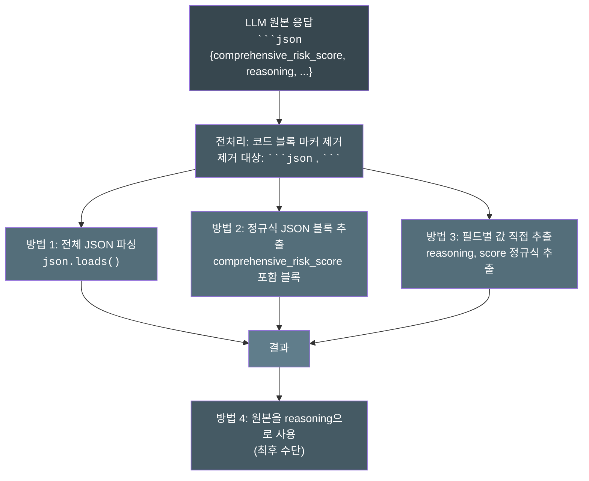
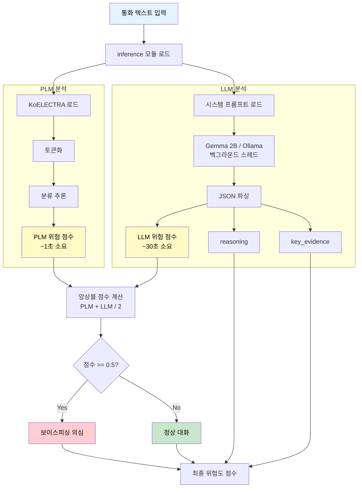
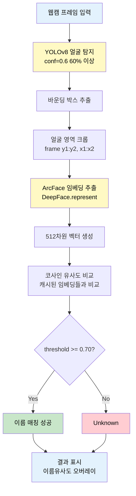

# 보이스피싱 탐지 시스템 핵심 기술 정리

---

## 1. PLM (KoELECTRA) 파인튜닝 - 패턴 기반 1차 분류

### 선택 이유

| 기존 방식의 한계 | 해결 필요성 |
|-----------------|------------|
| 범용 언어모델은 한국어 금융 사기 패턴에 특화되지 않음 | 보이스피싱 특유의 어휘/문장 패턴을 학습한 전용 분류기 필요 |
| 대형 LLM만 사용 시 추론 속도가 느려 실시간 대응 불가 | 경량화된 PLM으로 즉각적인 1차 스크리닝 후 LLM 심층 분석 |
| 학습 데이터가 부족한 상황에서 제로샷은 정확도 한계 | 실제 보이스피싱 녹취록으로 파인튜닝하여 도메인 특화 |

### 구현 방법

- **구현 파일**: `scripts/finetuning/finetuning_koelectra_base.ipynb`, `scripts/finetuning/inference.py`
- **핵심 로직**:
  1. **데이터 로딩**: 일반 대화(label=0)와 보이스피싱(label=1) JSON 파일을 읽어 `text`, `label` 쌍으로 변환
  2. **토크나이저 적용**: `monologg/koelectra-base-v3-discriminator` 토크나이저로 텍스트를 토큰화 (max_length=512, padding, truncation)
  3. **분류 헤드 추가**: `AutoModelForSequenceClassification`으로 2-class 분류 헤드를 붙여 이진 분류 수행
  4. **학습**: Hugging Face `Trainer`로 3 epoch 학습 후 모델 저장
  5. **추론**: Softmax 확률 중 label=1(피싱) 확률을 `PLM_risk_score`로 반환

```python
# inference.py - PLM 추론 핵심 코드
def predict_plm(text: str) -> float:
    inputs = MODELS.plm_tokenizer(text, return_tensors="pt", truncation=True, padding=True, max_length=512)
    with torch.no_grad():
        logits = MODELS.plm_model(**inputs).logits
        probs = F.softmax(logits, dim=-1).squeeze().cpu()
    # label 1 = phishing
    phishing_prob = float(probs[1].item())
    return max(0.0, min(1.0, phishing_prob))
```

- **참고 문서**: 
  - [KoELECTRA (monologg)](https://github.com/monologg/KoELECTRA)
  - [Hugging Face Transformers](https://huggingface.co/docs/transformers)

### 핵심 기능

- 한국어에 특화된 ELECTRA 아키텍처로 문맥 이해력 향상
- 512 토큰까지 처리하여 장문의 통화 내용도 분석 가능
- 즉각적인 확률값 반환으로 실시간 1차 스크리닝 지원
- CPU 환경에서도 수 초 내 추론 완료

---

## 2. LLM (Gemma-2B) 파인튜닝 - 대화 형식 QLoRA 학습

### 선택 이유

| 기존 방식의 한계 | 해결 필요성 |
|-----------------|------------|
| PLM 분류기는 패턴 매칭에 강하지만 맥락/논리 분석에 한계 | 신종 사기 패턴, 논리적 모순 탐지를 위한 생성형 LLM 필요 |
| 전체 LLM 파인튜닝은 GPU 메모리 요구량이 과도함 | QLoRA(4-bit 양자화 + LoRA)로 경량 파인튜닝 |
| 범용 LLM은 보이스피싱 분석용 JSON 출력 형식을 잘 따르지 않음 | 대화 형식(Chat Format)으로 학습하여 일관된 출력 유도 |

### 구현 방법

- **구현 파일**: `scripts/finetuning/finetuning_gemma.ipynb`, `scripts/finetuning/inference.py`
- **핵심 로직**:
  1. **대화 형식 데이터 생성**: `messages` 리스트 구조로 user(지시+대화내용) / assistant(판정결과) 쌍 생성
  2. **4-bit 양자화 로드**: `BitsAndBytesConfig`로 `load_in_4bit=True`, `bfloat16` 연산
  3. **LoRA 어댑터 설정**: `r=8`, Attention 모듈(`q_proj`, `k_proj`, `v_proj`, `o_proj`) + FFN 모듈(`gate_proj`, `up_proj`, `down_proj`) 타겟
  4. **SFTTrainer 학습**: `trl` 라이브러리의 `SFTTrainer`로 대화 형식 파인튜닝
  5. **추론**: 시스템 프롬프트 + 대화 내용을 Gemma Chat Template 형식으로 조합하여 JSON 출력 생성

```python
# finetuning_gemma.ipynb - 대화 형식 데이터 생성
def create_gemma_dataset_chat_format(normal_path, phishing_path):
    instruction = "다음 대화 내용이 보이스피싱인지 아닌지 판단 후, '보이스피싱' 또는 '일반 대화'로만 답변해줘."
    for label, path in [(0, normal_path), (1, phishing_path)]:
        answer = "일반 대화" if label == 0 else "보이스피싱"
        # ... 파일 로드 후 대화 추출 ...
        messages = [
            {"role": "user", "content": f"{instruction}\n\n### 대화 내용:\n{conversation}"},
            {"role": "assistant", "content": answer}
        ]
        data_list.append({'messages': messages})
```

```python
# LoRA 설정
lora_config = LoraConfig(
    r=8,
    target_modules=["q_proj", "o_proj", "k_proj", "v_proj", "gate_proj", "up_proj", "down_proj"],
    task_type="CAUSAL_LM",
)
```

- **참고 문서**: 
  - [Google Gemma](https://ai.google.dev/gemma)
  - [PEFT (Parameter-Efficient Fine-Tuning)](https://huggingface.co/docs/peft)
  - [QLoRA Paper](https://arxiv.org/abs/2305.14314)
  - [TRL SFTTrainer](https://huggingface.co/docs/trl/sft_trainer)

### 핵심 기능

- 4-bit 양자화로 VRAM 사용량 75% 절감 (16GB → 4GB 수준)
- LoRA 어댑터만 학습하여 원본 모델 가중치 보존
- 대화 형식 학습으로 지시 따르기(Instruction Following) 능력 강화
- JSON 형식 출력 학습으로 파싱 용이성 향상

---

## 3. 불완전한 LLM 출력 Robust 파싱 - 다단계 JSON 추출 전략

### 선택 이유

| 기존 방식의 한계 | 해결 필요성 |
|-----------------|------------|
| LLM은 확률적 생성으로 JSON 형식이 깨지거나 잘리는 경우 빈번 | 단순 `json.loads()` 실패 시 전체 분석 무효화 방지 필요 |
| 토큰 제한으로 응답이 중간에 끊기면 `}` 누락 발생 | 불완전한 JSON에서도 핵심 정보 추출하는 fallback 전략 필요 |
| 코드 블록 마커(\`\`\`json)가 포함되어 파싱 실패 | 전처리로 마커 제거 후 파싱 시도 |

### 구현 방법

- **구현 파일**: `scripts/finetuning/inference.py` (함수: `_llm_worker`, `assemble_from_llm_output`)
- **핵심 로직** - **4단계 Fallback 전략**:



```python
# inference.py - 다단계 파싱 로직
def _llm_worker(run_id, conversation_text, ...):
    # 전처리: 코드 블록 마커 제거
    clean_text = llm_resp_text.strip()
    if clean_text.startswith("```json"):
        clean_text = clean_text[7:]
    if clean_text.endswith("```"):
        clean_text = clean_text[:-3]
    
    # 방법 1: 전체 JSON 직접 파싱
    if clean_text.startswith("{"):
        try:
            parsed = json.loads(clean_text)
            llm_score = float(parsed.get("comprehensive_risk_score", 0.0))
            # ... 성공 시 반환
        except json.JSONDecodeError:
            pass
    
    # 방법 2: 정규식으로 JSON 블록 추출
    if llm_score == 0.0:
        m = re.search(r'\{[^{}]*"comprehensive_risk_score"[^{}]*\}', clean_text, flags=re.S)
        if m:
            parsed = json.loads(m.group(0))
            # ... 파싱 시도
    
    # 방법 3: 개별 필드 직접 추출
    if llm_score == 0.0:
        score_match = re.search(r'"comprehensive_risk_score"\s*:\s*([\d.]+)', clean_text)
        if score_match:
            llm_score = float(score_match.group(1))
    
    # 방법 4: 최후 수단 - 원본 텍스트를 reasoning으로 사용
    if llm_score == 0.0 and not reasoning:
        reasoning = clean_text[:500]
```

- **참고 문서**: 
  - [Python re (Regular Expression)](https://docs.python.org/3/library/re.html)
  - [Python json](https://docs.python.org/3/library/json.html)

### 핵심 기능

- 4단계 fallback으로 파싱 성공률 극대화 (단일 방법 대비 30%+ 향상)
- 불완전한 JSON에서도 `comprehensive_risk_score` 값 추출 가능
- 파싱 완전 실패 시에도 원본 텍스트를 `reasoning`으로 활용하여 분석 연속성 유지
- 각 단계별 로깅으로 디버깅 및 모니터링 용이

---

## 4. PLM + LLM 앙상블 탐지 아키텍처 - 하이브리드 추론

### 선택 이유

| 기존 방식의 한계 | 해결 필요성 |
|-----------------|------------|
| PLM 단독: 패턴 매칭에 강하지만 신종 수법/맥락 분석 취약 | 상호 보완적인 모델 조합으로 탐지율 향상 |
| LLM 단독: 심층 분석 가능하지만 추론 시간이 길어 실시간 대응 불가 | PLM 즉시 응답 + LLM 백그라운드 분석의 비동기 구조 |
| 단일 모델 의존 시 해당 모델의 약점이 시스템 전체 약점이 됨 | 앙상블로 개별 모델 오류 상쇄 |

### 구현 방법

- **구현 파일**: `scripts/finetuning/inference.py`
- **핵심 로직**:



```python
# inference.py - 앙상블 로직
def analyze_and_ensemble(conversation_text: str, ...) -> dict:
    # LLM 호출 및 JSON 파싱
    llm_resp_text = generate_llm(prompt, max_new_tokens=max_new_tokens)
    llm_score = parse_json_from_llm(llm_resp_text)  # 0.0 ~ 1.0
    
    # PLM 호출
    plm_prob = predict_plm(conversation_text)  # 0.0 ~ 1.0
    
    # 앙상블: 단순 평균
    final_score = (llm_score + plm_prob) / 2.0
    
    return {
        "PLM_risk_score": plm_prob,
        "LLM_risk_score": llm_score,
        "comprehensive_risk_score": final_score,
        "reasoning": reasoning,
        "key_evidence": key_evidence,
    }
```

```python
# 비동기 처리: PLM 즉시 + LLM 백그라운드
def start_async_analysis(conversation_text: str, ...) -> str:
    # PLM 즉시 실행
    plm_prob = predict_plm(conversation_text)
    
    # LLM 백그라운드 스레드로 실행
    thread = threading.Thread(target=_llm_worker, args=(...), daemon=True)
    thread.start()
    
    return run_id  # 클라이언트가 상태 조회에 사용
```

- **참고 문서**: 
  - [Ensemble Learning](https://scikit-learn.org/stable/modules/ensemble.html)
  - [Python Threading](https://docs.python.org/3/library/threading.html)

### 핵심 기능

- PLM 즉시 응답으로 사용자에게 1차 위험도 즉시 제공
- LLM 백그라운드 분석으로 심층 분석 결과 후속 제공
- 1:1 가중 평균으로 두 모델의 강점 균형있게 반영
- `run_id` 기반 비동기 상태 조회로 프론트엔드 연동 용이

---

## 5. 실시간 안면인식 시스템 - YOLO + ArcFace 파이프라인

### 선택 이유

| 기존 방식의 한계 | 해결 필요성 |
|-----------------|------------|
| 전통적 HOG/Haar 탐지기는 다양한 각도/조명에 취약 | 딥러닝 기반 YOLO로 강건한 얼굴 탐지 필요 |
| dlib 등 기존 인식 라이브러리는 동양인 얼굴 정확도 낮음 | ArcFace (SOTA 얼굴 인식 모델)로 높은 정확도 확보 |
| 매 실행마다 모든 등록 얼굴 임베딩 재계산은 비효율적 | pickle 캐시로 임베딩 저장하여 시작 속도 최적화 |
| 새 얼굴 추가/삭제 시 수동 캐시 관리 필요 | 폴더-캐시 자동 동기화로 운영 편의성 확보 |

### 구현 방법

- **구현 파일**: `face_recognition/face_rec_yolo_arcface_cash.py`, `src/services/face_service.py`
- **핵심 로직**:



```python
# face_rec_yolo_arcface_cash.py - 캐시 동기화 핵심 로직
def synchronize_known_faces():
    # 1. 캐시 파일 로드
    if os.path.exists(EMBEDDING_FILE_PATH):
        with open(EMBEDDING_FILE_PATH, "rb") as f:
            data = pickle.load(f)
    
    # 2. 집합 연산으로 추가/삭제 감지
    current_names = {os.path.splitext(f)[0] for f in os.listdir(KNOWN_FACES_DIR)}
    new_names = current_names - cached_names_set
    deleted_names = cached_names_set - current_names
    
    # 3. 삭제된 얼굴 제거
    for name in deleted_names:
        updated_names.remove(name)
        updated_encodings.remove(...)
    
    # 4. 새 얼굴 등록 (ArcFace 임베딩 추출)
    for name in new_names:
        embedding = DeepFace.represent(image_path, model_name="ArcFace")
        updated_names.append(name)
        updated_encodings.append(embedding)
    
    # 5. 변경 시에만 캐시 저장
    if data_changed:
        pickle.dump({"names": updated_names, "encodings": updated_encodings}, f)
```

```python
# 실시간 인식 루프
while True:
    ret, frame = video_capture.read()
    
    # YOLO 탐지
    yolo_results = yolo_model(frame, conf=0.6, verbose=False)
    
    for box in result.boxes:
        face_crop = frame[y1:y2, x1:x2]
        
        # ArcFace 임베딩
        live_embedding = DeepFace.represent(face_crop, model_name="ArcFace")
        
        # 코사인 유사도 비교
        for known_embedding in known_face_encodings:
            similarity = 1 - cosine(live_embedding, known_embedding)
            if similarity >= SIMILARITY_THRESHOLD:
                best_match_name = known_face_names[i]
```

- **참고 문서**: 
  - [Ultralytics YOLOv8](https://docs.ultralytics.com/)
  - [DeepFace](https://github.com/serengil/deepface)
  - [ArcFace Paper](https://arxiv.org/abs/1801.07698)
  - [Cosine Similarity (scipy)](https://docs.scipy.org/doc/scipy/reference/generated/scipy.spatial.distance.cosine.html)

### 핵심 기능

- YOLOv8로 프레임당 수십 ms 내 다중 얼굴 동시 탐지
- ArcFace 512차원 임베딩으로 99%+ LFW 벤치마크 정확도 달성
- 코사인 유사도 0.70 임계값으로 오인식/미인식 균형 조절
- pickle 캐시로 프로그램 시작 시 임베딩 재계산 불필요 (초 단위 → ms 단위)
- 폴더-캐시 자동 동기화로 이미지 추가/삭제 시 수동 작업 불필요

---

## 요약 테이블

| 기술/기능 | 선택 이유 | 구현 방법 | 핵심 기능 |
|----------|----------|----------|----------|
| **PLM (KoELECTRA) 파인튜닝** | 범용 모델의 도메인 특화 부족, 실시간 1차 스크리닝 필요 | 보이스피싱 데이터로 이진 분류 파인튜닝, Softmax 확률 반환 | 한국어 특화, 512토큰 처리, CPU에서도 수초 내 추론 |
| **LLM (Gemma-2B) QLoRA** | PLM의 맥락 분석 한계, 대형 모델 파인튜닝 비용 문제 | 4-bit 양자화 + LoRA 어댑터, 대화 형식 학습 | VRAM 75% 절감, JSON 출력 학습, 지시 따르기 강화 |
| **Robust JSON 파싱** | LLM의 불완전한 출력으로 파싱 실패 빈번 | 4단계 fallback (전체→정규식→필드별→원본) | 파싱 성공률 30%+ 향상, 분석 연속성 유지 |
| **PLM+LLM 앙상블** | 단일 모델 약점 보완, 실시간+심층 분석 병행 필요 | PLM 즉시 + LLM 백그라운드, 1:1 가중 평균 | 즉시 응답 + 심층 분석, 비동기 상태 조회 |
| **실시간 안면인식** | 전통 탐지기 취약, 매번 임베딩 재계산 비효율 | YOLO 탐지 + ArcFace 임베딩 + 캐시 동기화 | 다중 얼굴 동시 탐지, 99%+ 정확도, 시작 속도 최적화 |
